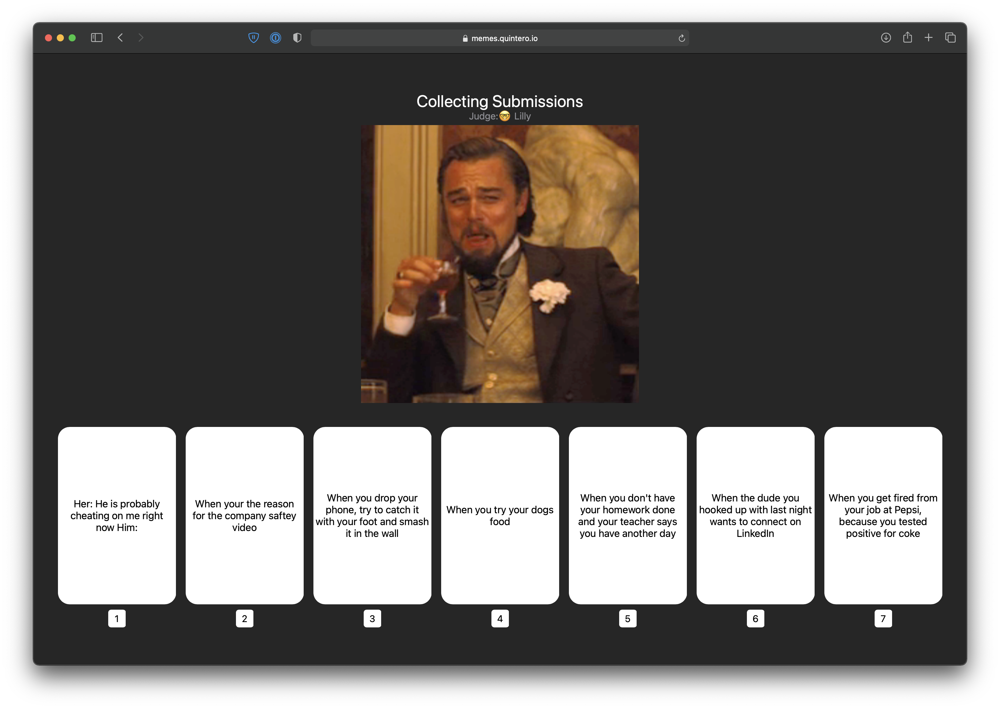

# memes

An online Multi-Player Meme Party Game written in Swift. 
That's right 100% Swift.

This Game is pretty much an online version of [What do you Meme](https://whatdoyoumeme.com), to get us through quarantine...
It is implemented with a [Vapor](https://vapor.codes) Server and a [Web Assembly](https://webassembly.org) Client communicating over web sockets.

## How does it work

This project consists of four targets:

- **Server:** A [Vapor](https://vapor.codes) server. It implements a single endpoint to open a Web Socket to play the game
- **Client:** it's well a client, built using [TokamakUI](https://github.com/TokamakUI/Tokamak) and [Swiftwasm](https://swiftwasm.org)
- **Model:** Shared codable structs that are used by both the Client and the Server
- **Events:** The Client and Server-Side Events that can be triggered

### Deployment

The [GitHub Actions](https://github.com/features/actions) setup for this project will on every commit in main:
- Build the server for both macOS and Ubuntu
- Compile the client code using Swiftwasm and push it to [GH Pages](https://pages.github.com)
- Push the server code to my personal [Dokku](http://dokku.viewdocs.io/dokku/) instance to start the deployment

### Game Data

Right now all the memes and captions for the game are stored in `deck.json`. 
It's not a lot, but enough for a first prototype.
Feel free to expand it or reuse it in any way.

## Contributions
Contributions are welcome and encouraged!

## Future Work

This game is no where near finished. 

The UI can be improved significantly:
- [ ] Spacing is very inconsistent
- [ ] It expects a slightly larger display and doesn't work on mobile

The memes and captions data set could always be expanded. 
And perhaps we should move to storing these in a database and provide multiple options for decks (i.e. Programmer Humor, Game of Thrones, etc.)

## License
This project is available under the MIT license. See the LICENSE file for more info.
